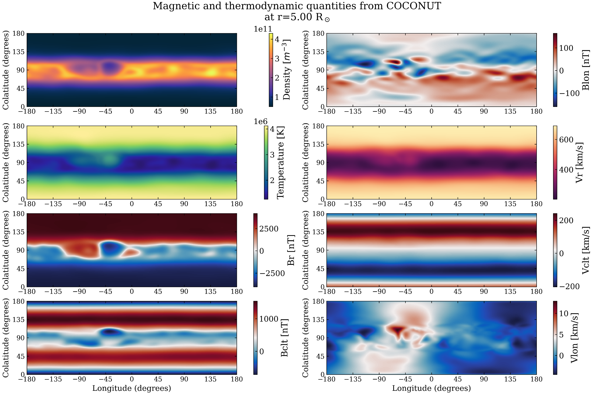
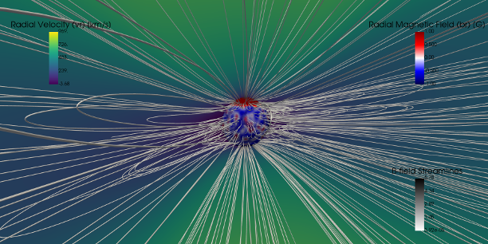
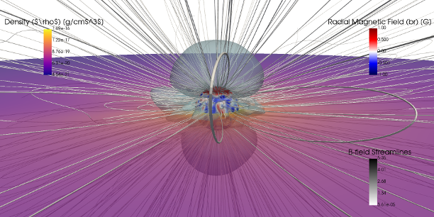
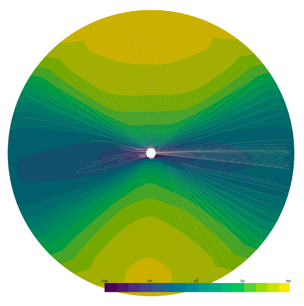
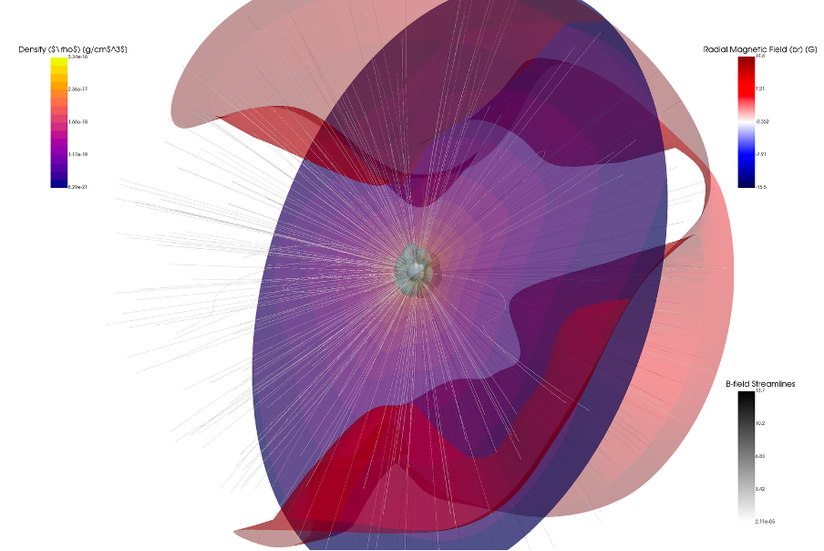
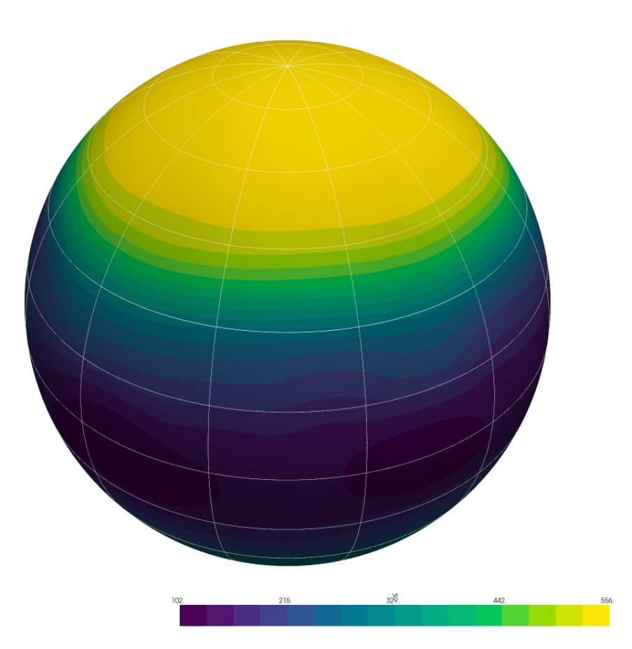

COCONUT Reader: Post-processing and Visualization
=================================================

This module provides tools to **read, analyze, and visualize**
COCONUT simulation outputs.

It combines:

- extraction of boundary data from CFmesh files
- generation of 2D maps from `.dat` files
- 2D/3D visualization from VTU files using PyVista
- diagnostic tools for boundary conditions

The main entry point is the function:

.. code-block:: python

   import coconut_tools.reader as rc
   rc.run_coconut_reader(...)

Notes and Recommendations
-------------------------

- Always merge VTU files before using the reader:

  .. code-block:: python

     from coconut_tools import group_vtu_files

     group_vtu_files.merge_all_snapshots(
         input_dir="./",
         output_dir="./vtu/",
	 start_time=0,
	 timestep=1,
	 nbmax=1,
	 stat=True,
         nb_proc=72,
         remove=False
     )
- currently set for stationnary run,
  .. code-block:: python

     start_time=?,
     timeste=?,
     nbmax=?,
     stat=False,

  should be adapted otherwise, 
     
- ``nb_proc`` should match the number of MPI processes used.

- Avoid ``remove=True`` unless intermediate files can be deleted.

Overview of Features
--------------------

The module implements a **complete post-processing pipeline**:

1. Extract spherical boundaries from CFmesh
2. Generate `.dat` files and 2D maps
3. Produce PyVista slice visualizations from VTU
4. Perform diagnostics on inner and outer boundaries
5. Provide quick visualization utilities

Outputs are written to:

- ``dat/``: extracted boundary data
- ``plots/``: generated figures

Main Pipeline: run_coconut_reader
---------------------------------

The function ``run_coconut_reader`` runs the full workflow.

.. code-block:: python

   import coconut_tools.reader as rc

   rc.run_coconut_reader(
       cfmesh_name="corona.CFmesh",
       vtu_relpath="vtu/corona-mhd_0000.vtu",
       radii=(5.0, 10.0),
       inner_bc_check=True,
       outer_bc_check=True,
       AlfvSurf=True
   )

Key steps performed:

- Extract boundaries at given radii
- Generate `.dat` files (if not already present)
- Produce 2D surface plots
- Generate PyVista slices
- Optionally compute Alfvén surface visualization

.. note::

   Existing `.dat` files are not recomputed, ensuring efficiency.

Boundary Extraction and 2D Maps
-------------------------------

For each radius:

- Data are extracted from the CFmesh
- Saved as ``Rsun.dat``
- Plotted as 2D maps (longitude vs colatitude)

These plots include:

- density
- temperature
- magnetic field
- pressure

   Example of 2D surface maps generated from CFmesh data.

Boundary Condition Diagnostics
------------------------------

Two diagnostic tools are available:

- ``inner_bc_check``
- ``outer_bc_check``

They evaluate physical consistency of the simulation.

Inner boundary plots include:

- density
- temperature
- radial magnetic field
- pressure

Outer boundary plots include:

- sound speed
- Alfvén speed
- Mach number
- Alfvénic Mach number

.. figure:: figures/boundary_checks.png
   :width: 600px

   Inner and outer boundary diagnostics.

PyVista Visualization
---------------------

The module uses PyVista to visualize VTU data.

Pipeline:

1. Read mesh
2. Convert units
3. Convert to spherical coordinates
4. Generate slices or 3D views

Example slice:

.. code-block:: python

   rc.run_coconut_reader(
       vtu_relpath="vtu/corona-mhd_0000.vtu"
   )

   Example PyVista slice visualization.

Alfvén Surface Visualization
----------------------------

Enable with:

.. code-block:: python

   rc.run_coconut_reader(..., AlfvSurf=True)

This produces:

- density slice
- Alfvén surface
- optional iso-contours

   Alfvén surface visualization.

Quick Visualization Tools
-------------------------

Quick_Vr_Viewer
^^^^^^^^^^^^^^^

Provides a fast 2D disk visualization (Tecplot-like).

.. code-block:: python

   rc.Quick_Vr_Viewer(
       vtu_relpath="vtu/corona-mhd_0000.vtu",
       plane="y",
       cam_dist=150.
   )

Features:

- selectable plane (x, y, z, or longitude)
- field selection (e.g. vr, br, density)
- optional magnetic field lines

   Example of Quick_Vr_Viewer output.

Quick_Ra_viewer
^^^^^^^^^^^^^^^

Produces a fast 3D visualization including:

- density slices
- magnetic topology
- Alfvén surface
- iso-contours of velocity

.. code-block:: python

   rc.Quick_Ra_viewer(
       vtu_relpath="vtu/corona-mhd_0000.vtu",
       volumic_vr=500.
   )

   Example 3D visualization.

Spherical Surface Visualization
-------------------------------

Plot scalar quantities on a spherical surface at a given radius.

.. code-block:: python

   rc.visualize_spherical_surface_from_vtu(
       vtu_path="vtu/corona-mhd_0000.vtu",
       r_surf=2.5,
       field="vr",
       view="iso"
   )

Options:

- camera view (x, y, z, iso)
- Carrington grid overlay
- customizable resolution

   Spherical surface visualization.

Y-plane Disk Visualization
--------------------------

Function:

.. code-block:: python

   rc.visualize_yplane_disk(mesh, field="vr")

Features:

- full-disk projection
- field line tracing
- customizable seeding and integration

This provides a **centered disk view** similar to solar observations.

Data Flow Summary
-----------------

The processing workflow is:

::

   CFmesh  --->  .dat files  --->  2D surface plots
      |
      +---> VTU ---> PyVista ---> 2D/3D visualizations

Documentation and Help
----------------------

Each function is documented via docstrings.

In IPython:

.. code-block:: python

   rc.run_coconut_reader?
   rc.Quick_Vr_Viewer?

Source code documentation is available in:

::

   coconut_tools/src/coconut-tools/*.py

contact: Q. Noraz
