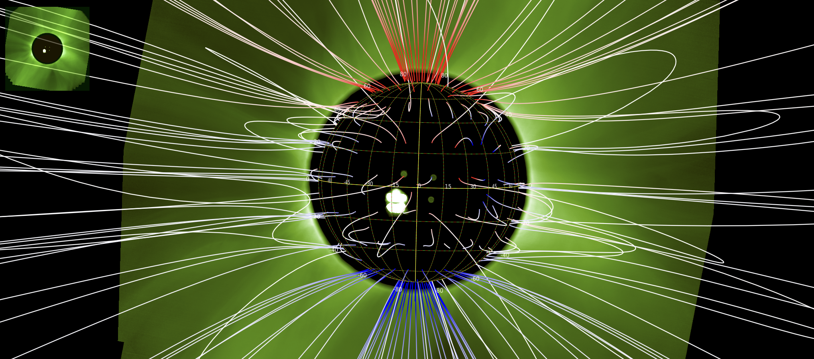

# Exporting COCONUT Field Lines to JHelioviewer

`coconut_tools.visualization_3d.coconut_to_jhv` converts a COCONUT/COOLFluid `.vtu` or `.CFmesh` file
into a SunJSON file containing magnetic-field lines for JHelioviewer.

The script:

1. Reads the COCONUT mesh and its Cartesian magnetic-field components.
2. Traces magnetic-field streamlines from a spherical seed grid.
3. Optionally creates a PyVista preview.
4. Exports the field lines in SunJSON coordinates:
   `[radius, Carrington longitude, Carrington latitude]`.

The mesh coordinates are assumed to be in solar radii, with the `x-y` plane
as the solar equatorial plane and `z` pointing toward solar north.

## Command-line use

Basic export:

```bash
python -m coconut_tools.visualization_3d.coconut_to_jhv corona.CFmesh fieldlines.json
```

Export with a screenshot and progress bars:

```bash
python -m coconut_tools.visualization_3d.coconut_to_jhv corona.CFmesh fieldlines.json --screenshot preview.png --progress
```

Color the field lines by the radial magnetic field, `Br`:

```bash
python -m coconut_tools.visualization_3d.coconut_to_jhv corona.CFmesh fieldlines.json \
  --screenshot preview.png \
  --progress \
  --color-by br
```

The screenshot and SunJSON export use the same blue-white-red colormap.
Its limits are symmetric and set to `[-2 std(Br), +2 std(Br)]` using the
interpolated field-line values in gauss.

When `--observation-date YYYYMMDDHHMMSS` is provided, the preview camera is
placed at the Earth/Stonyhurst viewpoint for that date.

Longitude orientation can be adjusted when required:

```bash
python -m coconut_tools.visualization_3d.coconut_to_jhv input.vtu fieldlines.json \
  --longitude-offset-deg 180 \
  --flip-longitude
```

These longitude options are low-level manual corrections applied to the
exported SunJSON coordinates. They are not used to define the physical seed
locations in the COCONUT mesh.

The default seed count is 200. Use `--n-seed-points` to change it.

## Specific fieldlines seeds

Implemented as a new option:
```bash
--seed-limb-longitudes
```

This seeds only the two displayed limb longitudes:
```bash
phi = -90 deg
phi = +90 deg
```
and spans the full latitude range:
```bash
lat = -90..+90 deg
```
It does not seed the whole visible hemisphere.
The limb longitudes are interpreted in the Earth-visible Stonyhurst frame and
converted to Carrington longitudes before tracing field lines. This keeps the
mesh tracing and SunJSON export in Carrington coordinates while selecting the
limbs seen by JHelioviewer.
Example:
```bash
python coconut_to_jhv.py input.CFmesh fieldlines.json \
  --seed-limb-longitudes \
  --observation-date 20250101000000 \
  --n-seed-points 200
```
With `--n-seed-points 200`, it creates about 100 latitude seed positions on each of the two limb longitudes.

## Python use

```python
from coconut_tools.visualization_3d.coconut_to_jhv import export_to_jhv_json

export_to_jhv_json(
    input_file="corona.CFmesh",
    output_json="fieldlines.json",
    screenshot="preview.png",
    use_tqdm=True,
    color_by="br",
)
```

## Open in JHelioviewer

1. Start JHelioviewer.
2. Drag and drop `fieldlines.json` into the JHelioviewer window.
3. In the layer list, enable the checkbox for the **Connection** layer.

The exported magnetic-field lines should then appear in the 3D view.


