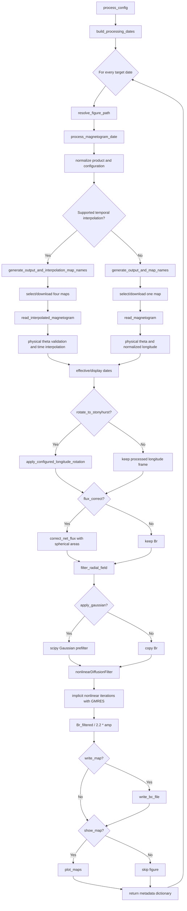

# Nonlinear-Diffusion Magnetogram Pipeline

This document follows the complete execution of
`NLD_implicit_method.process_config`, from the requested time to the COCONUT
boundary file. It also distinguishes the physically aware parts of the common
magnetogram pipeline from the current pixel-space assumptions of the nonlinear
diffusion kernel.

## Entry point

```python
from coconut_tools.magnetogram.NLD_implicit_method import process_config

results = process_config(config)
```

The return value is always a list of per-date metadata dictionaries.

## Complete call cycle



### Function-by-function summary

| Order | Function | Responsibility | Main output |
|---:|---|---|---|
| 1 | `process_config` | Expand the time range and loop over targets | List of result dictionaries |
| 2 | `build_processing_dates` | Construct the requested cadence | `list[datetime]` |
| 3 | `resolve_figure_path` | Resolve per-date figure naming | PNG path or `None` |
| 4 | `process_magnetogram_date` | Orchestrate one NLD boundary preparation | One result dictionary |
| 5a | `generate_output_and_map_names` | Select/download one map | Boundary path and source path |
| 5b | `generate_output_and_interpolation_map_names` | Acquire the four temporal neighbors | Boundary path, paths, selection |
| 6a | `read_magnetogram` | Read and normalize one physical map | `Br, Theta, Phi` |
| 6b | `read_interpolated_magnetogram` | Validate and interpolate four maps | `Br, Theta, Phi, Br_linear` |
| 7 | `apply_configured_longitude_rotation` | Optionally roll the field to Stonyhurst | Rotated fields and angle |
| 8 | `correct_net_flux` | Optionally balance area-integrated flux | Corrected `Br` |
| 9 | `filter_radial_field` | Apply the optional Gaussian and call NLD | Filtered field and timestep |
| 10 | `nonlinearDiffusionFilter` | Assemble and solve the nonlinear sparse systems | Raw NLD field and `tau` |
| 11 | `/ 2.2 * amp` | Apply the pipeline field normalization | Final `Br_filtered` |
| 12 | `write_bc_file` | Optionally write `x y z Br` | COCONUT `.dat` file |
| 13 | `plot_maps` | Optionally compare prefilter and final fields | PNG figure |

## Stage 1: date loop and figure naming

`process_config` delegates date generation to
`io.downloads.build_processing_dates`.

- `date` alone produces one target.
- A positive `total_hours` activates a sequence and requires a positive
  `cadence_hours`.
- The final bound is exclusive: dates are added while
  `current < start + total_hours`.
- `candence` remains accepted as a legacy spelling of `cadence_hours`.

If an explicit figure filename is used for several dates,
`resolve_figure_path` appends a compact timestamp to prevent figure
overwriting.

## Stage 2: acquisition and temporal interpolation

The product name is normalized case-insensitively. The supported products are
GONG synchronic/diachronic variants, ADAPT, HMI-FDT, HMI small, HMI
polar-filled, HMI-SYNC, HMI-hourly, and WSO.

The non-interpolated branch calls `generate_output_and_map_names`, which:

1. computes the Carrington rotation number for the target;
2. builds a name such as `map_gong_NLD.dat`;
3. reuses a matching local file or selects/downloads the closest product.

For integral GONG products, candidates are collected from the previous,
current, and next calendar month before the closest filename time is selected.
This prevents choosing the following Carrington rotation solely because the
requested date and its archive folder share a month.

The interpolated branch is possible for synchronic GONG, ADAPT, HMI-hourly,
and HMI-FDT. It selects the four-map stencil

```text
before_previous, before, after, after_next
```

around the requested time. The reader normalizes all four maps before doing
pixel-by-pixel interpolation. It rejects different shapes, different physical
latitude centers, and, for HMI-FDT, different fixed Carrington longitude axes.

`interpolation_order=1` returns a linear interpolation. Order `2` uses a cubic
Hermite expression whose endpoint derivatives use the two outer maps. The
linear result is also returned as `Br_linear`; it is rotated with the main
field but is not passed to the NLD filter.

Temporal interpolation defaults to enabled for temporal GONG and ADAPT. It must
be explicitly enabled for HMI-hourly and HMI-FDT. It is forbidden for GONG
diachronic products.

### Custom local FITS input

`custom_magnetogram` bypasses all acquisition and interpolation code, assigns
the internal type `custom`, and calls `read_magnetogram` directly. `map_type`
is optional in this mode:

```python
config = {
    "date": "2026-08-01T16:24:00",
    "custom_magnetogram": r"C:\Users\luisl\Desktop\AI_synopt_20260801_162400_TAI.fits",
    "interpolation": True,          # ignored for custom input
    "rotate_to_stonyhurst": True,
}
```

The custom reader requires a single 2D FITS image, complete latitude WCS, and
a separable regular longitude axis covering exactly 360 degrees. It derives
axis direction and origin from the header, reverses negative longitude axes,
and rolls the field to the smallest wrapped longitude unless a known original
product is identified from its metadata.

An original GONG FITS is the intentional exception. Matching GONG provenance
keywords automatically select the native GONG reader and longitude convention
without reading or interpreting the filename. The configured date is used for
both display and rotation. Renaming a
FITS therefore cannot change its result. This makes an unspecified custom GONG
file numerically identical to the same file read with an explicit GONG map
type, including legacy files that omit
`CUNIT1` and `CUNIT2`. Missing longitude units on other complete solar WCS
axes are inferred from the axis code and full-sphere numeric span with a
warning.

Original JSOC HMI synoptic FITS files are also recognized from the combined
`ORIGIN`, `TELESCOP`/`INSTRUME`, `CONTENT`, `CTYPE1`, and `CTYPE2` metadata.
They reuse the native HMI convention: the magnitude of `CDELT1` defines the
longitude spacing and a negative header sign does not reverse the stored
`Br` columns. Updated/daily products retain the native Carrington-origin roll.
Other custom FITS files continue to obey the WCS sign normally.

The effective/display time of every custom input is `config["date"]`, and the
rotation uses that exact same value. FITS time keywords are retained as useful
metadata but cannot silently replace the user-selected epoch.

Custom rotation distinguishes the reference frame from the WCS axis code:
`CRLN-*` is Carrington and `HGLN-*` is already Stonyhurst. For Carrington
input, the central meridian is computed from `config["date"]`. An
ambiguous `LON-CAR` axis is rejected because `-CAR` describes the
plate-carree projection, not the longitude reference frame.

## Stage 3: physical magnetogram coordinates

`read_magnetogram` and `read_interpolated_magnetogram` produce:

```text
Br.shape == Theta.shape == Phi.shape
theta = Theta[:, 0]   # physical colatitude centers in radians
phi   = Phi[0, :]     # longitude centers in radians
```

For FITS maps, `read_fits_theta_axis` reconstructs latitude from the header.
Explicit sine-latitude/`CSLT` declarations have priority, angular CEA WCS is
inverted with Astropy/WCSLIB, and ordinary angular axes use `CRPIX2`, `CRVAL2`,
`CDELT2` or `CD2_2`, `CTYPE2`, `CUNIT2`, and `LATTYPE`.

The resulting theta axis must be finite, strictly increasing north-to-south,
and contained in `[0, pi]`. Field rows are flipped when necessary to match it.
When the metadata are insufficient, the warned product fallback is:

- uniform cell centers in `cos(theta)=sin(latitude)` for GONG and HMI;
- uniform cell centers in latitude for ADAPT and HMI-FDT.

No pole center is manufactured. `resize=True` resamples the map to `360 x 720`
and rebuilds theta centers while retaining the original physical outer cell
edges in the native coordinate.

Longitude columns are made increasing, HMI dynamic products are rolled to
Carrington zero, and temporal GONG maps receive their filename-encoded circular
shift. Non-finite field values are replaced with finite values.

## Stage 4: time and longitude frame

The effective time is the requested time for interpolated and custom maps. For most
non-interpolated temporal products it is parsed from the selected filename;
HMI small, HMI polar-filled, and WSO use the target time by convention.

When `rotate_to_stonyhurst=True`,
`processing.longitude.apply_configured_longitude_rotation`:

1. obtains the Carrington central meridian at the effective time;
2. reconstructs the longitude centers in the same column order as `Br`;
3. finds the nearest actual column to the required zero meridian;
4. circularly rolls `Br` and, when present, `Br_linear`.

For a custom Carrington FITS, the central meridian is computed at the explicit
configured date. A native custom `HGLN-*` map is left unchanged. The actual normalized cell centers are used,
including a nonzero first center and the resized grid when applicable.

The theta grid is unchanged. The standard output `phi` coordinates also remain
unchanged; the frame transformation is represented by the field-column roll.
WSO keeps its duplicate longitude endpoint consistent.

## Stage 5: optional physical flux balancing

If `flux_correct=True`, `correct_net_flux` computes the solid angle of every
cell from physical edges:

```math
Delta Omega_ij = |cos(theta_{i-1/2}) - cos(theta_{i+1/2})| Delta phi_j.
```

Edges are extrapolated in `cos(theta)` for sine-latitude grids and in `theta`
for latitude grids, then clipped to the physical poles. Available corrections
are:

- `surface_mean`: subtract the area-weighted global mean;
- `polarity_scaling`: rescale positive and negative polarities so their
  integrated flux magnitudes match.

This correction is applied before Gaussian smoothing and nonlinear diffusion.
There is no second flux correction after NLD, so the written field contains
whatever small numerical flux residual the filtering stage produces.

## Stage 6: NLD wrapper

`filter_radial_field` receives `Br`, `phi`, and `theta`, but the current NLD
discretization does not derive its metric from the coordinate arrays. Its
numerical spacings are exactly `dx_override` and `dy_override`, both `1.0` by
default. The coordinate arguments are retained for a common high-level filter
signature.

If `apply_gaussian=True`, `scipy.ndimage.gaussian_filter` first smooths the map
with `gaussian_sigma` expressed in pixels. Otherwise a copy of `Br` is passed
directly to the nonlinear solver.

## Stage 7: implicit nonlinear diffusion

The low-level implementation is
`filters.nonlinear_diffusion.nonlinearDiffusionFilter`. For a field `u`, it
estimates centered finite-difference gradients and the Perona-Malik
diffusivity

```math
g(|grad u|) = 1 / sqrt(1 + |grad u|^2 / lambda^2).
```

`lambda` is a robust gradient scale:

```math
lambda = 1.4826 median(| |grad u| - median(|grad u|) |).
```

Machine epsilon replaces `lambda` when the estimate is zero.

For each pixel, a sparse diffusion operator is assembled with geometric-mean
diffusivities on neighbor interfaces. The topology is:

- periodic left/right neighbors, representing longitude wrapping;
- no neighbor beyond the first or last row, representing nonperiodic latitude
  boundaries;
- constant `dx_override` and `dy_override` everywhere.

Each nonlinear iteration forms a semi-implicit system of the form

```math
(I - tau F(u)/2) u_new = u_old + tau F_old u_old / 2
```

and solves it with SciPy GMRES (`atol=1e-5`). The diffusivity/operator is then
updated for the next iteration. The solver logs the GMRES exit code, elapsed
time, estimated remaining time, and the logarithm of the update norm. The
returned `timestep` is the configured `tau`; it is not adaptively changed by
the current implementation.

### Physical interpretation of the current grid treatment

The common pipeline is physically aware of the FITS theta grid for reading,
flux integration, plotting, and boundary coordinates. The NLD kernel itself is
a Cartesian pixel-space operator with user-supplied constant spacings. It does
not currently include:

- the `sin(theta)` factors of a spherical diffusion operator;
- latitude-dependent physical longitude spacing `R_sun sin(theta) Delta phi`;
- cell-area weights inside the diffusion solve.

Consequently, changing from an artificial theta axis to the physical FITS axis
fixes the geometry around NLD, but does not convert the NLD equation itself
into a fully spherical diffusion equation. `dx_override` and `dy_override`
should therefore be interpreted as numerical filter scales, not automatically
derived physical distances.

## Stage 8: normalization, output, and plotting

After filtering, the pipeline applies:

```text
Br_filtered = Br_filtered / 2.2 * amp
```

With `write_map=True`, `write_bc_file` writes `x y z Br` on a sphere of radius
`r_st`. Coordinates use the physical theta centers and the standard processed
phi axis. A latitude row is collapsed to a single Cartesian point only if its
center is truly at `theta=0` or `theta=pi` within `1e-12`; all ordinary
near-polar rings retain every longitude.

With `show_map=True`, `plot_maps` compares the field entering NLD with the
normalized NLD result. The first panel is therefore after longitude rotation
and optional flux correction. The plotting code uses physical cell edges,
supports latitude or sine latitude, uses `pcolormesh` on nonuniform axes, and
uses robust symmetric color limits based on the 99th absolute percentile.

## Configuration reference

| Key | Default | Role |
|---|---:|---|
| `date` | required | Initial target time |
| `map_type` | required unless custom | Magnetogram product |
| `custom_magnetogram` | `None` | Local 2D FITS path; overrides `map_type`, acquisition, and interpolation |
| `cadence_hours` | unset | Time-series cadence (`candence` is a legacy alias) |
| `total_hours` | unset | Exclusive time-series duration |
| `output_dir` | `../` | Boundary and default download directory |
| `download_dir` | `output_dir` | Four-map interpolation download directory |
| `output_path_fig` | unset | Figure filename or directory |
| `adapt_map` | `6` | Zero-based ADAPT/HMI-FDT ensemble index |
| `interpolation` | product-dependent | Enable supported four-map interpolation |
| `interpolation_order` | `2` | `1` linear or `2` cubic Hermite; `Interp_order` is accepted |
| `resize` | `False` | Resample to `360 x 720` while preserving latitude bounds |
| `rotate_to_stonyhurst` | `True` | Roll field columns into the Stonyhurst frame |
| `flux_correct` | `False` | Balance integrated flux before NLD |
| `flux_correction_method` | `surface_mean` | `surface_mean` or `polarity_scaling` |
| `apply_gaussian` | `True` | Enable the Gaussian prefilter |
| `gaussian_sigma` | `1.0` | Gaussian width in pixels |
| `tau` | `5` | Implicit diffusion time step |
| `iterations` | `7` | Number of nonlinear diffusion iterations |
| `dx_override` | `1.0` | Constant horizontal numerical spacing |
| `dy_override` | `1.0` | Constant vertical numerical spacing |
| `amp` | `1` | Multiplicative amplitude after `/2.2` |
| `r_st` | `1.0` | Boundary-sphere radius |
| `write_map` | `True` | Write the `.dat` boundary file |
| `show_map` | `True` | Save the comparison figure |
| `visu_type` | `sinlat` | `lat` or sine-latitude plotting |
| `drms_email` / `jsoc_email` | unset | JSOC identity where required |

Boolean-like strings (`"true"`, `"yes"`, `"1"`, `"on"`) are accepted for
boolean settings.

## Returned metadata

Each processed target returns:

| Key | Meaning |
|---|---|
| `date` | Requested target as `datetime` |
| `effective_date` | Time represented by the selected/interpolated field |
| `magnetogram_date` | Figure-title date |
| `output_name` | Intended NLD `.dat` path |
| `local_file` | One input path or a list of four paths |
| `figure_path` | Saved figure path, or `None` |
| `selection` | Interpolation stencil and weights, or `None` |
| `Br_linear` | Linear temporal interpolation, or `None` |
| `timestep` | `tau` returned by the NLD solver |
| `rotation_angle` | Applied longitude rotation in degrees, or `None` |

The filtered arrays themselves are written/plotted but are not included in the
metadata dictionary.

## Validation and operational notes

- The common reader rejects invalid latitude WCS and incompatible temporal
  grids.
- The low-level NLD function does not currently perform comprehensive checks
  on image dimensionality, iteration count, `tau`, or spacing sign; callers
  should provide a finite two-dimensional field, positive spacings, a sensible
  positive time step, and a non-negative iteration count.
- A GMRES nonzero exit code is logged but does not currently raise an
  exception.
- The `.dat` filename contains product and method but no target timestamp. In a
  multi-date run using one `output_dir`, later outputs replace earlier ones.

## Module ownership

| Responsibility | Module |
|---|---|
| NLD workflow orchestration and wrapper | `magnetogram.NLD_implicit_method` |
| Low-level sparse NLD kernel | `magnetogram.filters.nonlinear_diffusion` |
| Product selection, dates, downloads | `magnetogram.io.downloads` |
| Physical FITS reading and interpolation | `magnetogram.io.readers` |
| Latitude geometry and cell areas | `magnetogram.core.coordinates` |
| Longitude/Stonyhurst handling | `magnetogram.processing.longitude` |
| Optional flux balancing | `magnetogram.processing.flux_balance` |
| COCONUT boundary writer | `magnetogram.io.writers` |
| Diagnostic plotting | `magnetogram.visualization.plotting` |
