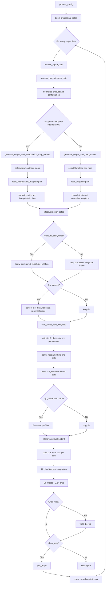

# Local Weighted (Yaroslavsky-Style) Magnetogram Pipeline

This document describes every stage executed by
`Yaroslavsky_filter.process_config`. The launch module orchestrates the common
magnetogram preparation pipeline and then applies the local nonlinear weighted
kernel implemented in `filters.yaroslavsky`.

## Entry point

```python
from coconut_tools.magnetogram.Yaroslavsky_filter import process_config

results = process_config(config)
```

`results` is always a list containing one metadata dictionary per target date.

## Complete call cycle



### Function-by-function summary

| Order | Function | Responsibility | Main output |
|---:|---|---|---|
| 1 | `process_config` | Expand the run and iterate over target times | List of result dictionaries |
| 2 | `build_processing_dates` | Construct the requested cadence | `list[datetime]` |
| 3 | `resolve_figure_path` | Resolve per-target figure naming | PNG path or `None` |
| 4 | `process_magnetogram_date` | Orchestrate one weighted-filter boundary | One result dictionary |
| 5a | `generate_output_and_map_names` | Select/download one source map | Boundary path and source path |
| 5b | `generate_output_and_interpolation_map_names` | Acquire four temporal neighbors | Boundary path, paths, selection |
| 6a | `read_magnetogram` | Read and normalize the physical map | `Br, Theta, Phi` |
| 6b | `read_interpolated_magnetogram` | Validate grids and interpolate in time | `Br, Theta, Phi, Br_linear` |
| 7 | `apply_configured_longitude_rotation` | Optionally roll the field to Stonyhurst | Rotated fields and angle |
| 8 | `correct_net_flux` | Optionally balance area-integrated flux | Corrected `Br` |
| 9 | `filter_radial_field_weighted` | Validate inputs, derive `delta`, and pre-smooth | Raw weighted-filter field |
| 10 | `filter3` | Dispatch one local nonlinear average per pixel | Filtered two-dimensional field |
| 11 | `Th` and `main_loop_integration` | Build weights and perform normalized Simpson integration | One output pixel per task |
| 12 | `/ 2.2 * amp` | Apply the pipeline field normalization | Final `Br_filtered` |
| 13 | `write_bc_file` | Optionally write the boundary | COCONUT `.dat` file |
| 14 | `plot_maps` | Optionally save the comparison | PNG figure |

## Stage 1: target-date sequence

`process_config` calls `io.downloads.build_processing_dates`.

- A configuration containing only `date` processes one map.
- Positive `total_hours` activates a sequence and requires positive
  `cadence_hours`.
- The time interval is end-exclusive.
- The legacy misspelling `candence` is accepted if `cadence_hours` is absent.

When several dates share an explicit figure filename, a target timestamp is
inserted before the extension. Default figure names use the effective
magnetogram time.

## Stage 2: map selection and interpolation

Map types are normalized case-insensitively. Supported families are GONG,
ADAPT/HMI-FDT, HMI small/polar-filled/SYNC/hourly, and WSO.

Without temporal interpolation,
`io.downloads.generate_output_and_map_names` computes the Carrington rotation,
constructs the Yaroslavsky `.dat` filename, and reuses or downloads the nearest
appropriate map.

Integral GONG selection gathers candidates from the previous, current, and
next calendar month before choosing the closest filename time. It therefore
does not jump to the following Carrington rotation just because only that
rotation has a folder in the requested month.

Temporal interpolation is available for synchronic GONG products, ADAPT,
HMI-hourly, and HMI-FDT. Four maps are selected:

```text
before_previous -> before -> target -> after -> after_next
```

Before interpolation, each field is normalized to its physical north-to-south
latitude and increasing-longitude convention. All shapes and theta centers
must agree. HMI-FDT maps must also share one full fixed Carrington longitude
grid. This avoids any silent spatial remapping between temporal samples.

- Order `1` uses the weighted linear combination of the two bracketing maps.
- Order `2` uses cubic Hermite interpolation with derivatives estimated using
  all four samples.

The additional linear result `Br_linear` is retained and rotated, but the
Yaroslavsky filter operates on the selected main result `Br`.

Interpolation defaults to true for temporal GONG and ADAPT. HMI-hourly and
HMI-FDT require `interpolation=True`. GONG diachronic maps do not support it.

### Custom local FITS input

When `custom_magnetogram` contains a local path, the pipeline assigns
`map_type="custom"`, skips every download/interpolation function, and reads the
file directly. No explicit product type is required:

```python
config = {
    "date": "2026-08-01T16:24:00",
    "custom_magnetogram": r"C:\Users\luisl\Desktop\AI_synopt_20260801_162400_TAI.fits",
    "interpolation": True,          # ignored for custom input
    "rotate_to_stonyhurst": True,
}
```

The current generic reader accepts one 2D FITS image whose header completely
defines latitude and a separable, regular, full-360-degree longitude axis. It
supports degree or radian longitude units, reverses decreasing columns, and
rolls the smallest wrapped longitude to the first output column. It refuses to
guess a product-specific latitude fallback.

Original GONG FITS files receive a narrowly scoped automatic compatibility
path. If their provenance keywords identify GONG, the pipeline reuses the same
native reader and longitude convention as an explicit GONG run. The configured
date controls both display and rotation. The filename is never used for this inference, so renaming the FITS
cannot alter its interpretation. The output is therefore numerically identical
even though old GONG headers commonly omit
`CUNIT1` and `CUNIT2`. For other complete solar-WCS files, a missing longitude
unit can be inferred from a 360-degree or `2*pi` full-sphere span with a
warning.

Original JSOC HMI synoptic maps receive the corresponding native HMI
compatibility path when their provenance, `CONTENT`, and Carrington CEA WCS
headers agree. Their longitude spacing uses `abs(CDELT1)` without reflecting
the stored `Br` columns; updated/daily maps still apply their physical
Carrington-origin roll. All other custom FITS inputs continue to respect a
negative WCS longitude step by reversing the data columns. Detection never
uses the filename.

The effective and display date of a custom input is always `config["date"]`.
That same value is used for rotation. Header dates remain readable as metadata
but do not override the explicit user choice.

Custom rotation reads the frame from `CTYPE1`: `CRLN-*` means Carrington and
`HGLN-*` means Stonyhurst. Carrington input uses the ephemeris central meridian
at `config["date"]`. Native Stonyhurst input is not rolled. Ambiguous names
such as `LON-CAR` are rejected because `-CAR` is a projection code rather than
a Carrington-frame declaration.

## Stage 3: physical theta and phi grids

The readers return matching two-dimensional arrays:

```text
Br.shape == Theta.shape == Phi.shape == (Ntheta, Nphi)
theta = Theta[:, 0]       # radians, strictly north to south
phi   = Phi[0, :]         # radians, increasing around the Sun
```

For FITS products, physical latitude centers are decoded from `CTYPE2`,
`CUNIT2`, `LATTYPE`, `CRPIX2`, `CRVAL2`, and `CDELT2`/`CD2_2`. Explicit
sine-latitude metadata has priority; standards-compliant angular CEA is
inverted through Astropy/WCSLIB. The reader rejects non-finite, nonmonotonic,
or out-of-range latitude axes and reverses data rows when needed.

If metadata are incomplete, a warning precedes the product-specific fallback:

- GONG/HMI centers are uniform in `cos(theta)=sin(latitude)`;
- ADAPT/HMI-FDT centers are uniform in latitude.

These are cell centers, not manufactured poles. When `resize=True`, the field
becomes `360 x 720` and the new theta centers preserve the source grid's outer
physical edges in its native coordinate.

Longitude columns are normalized using their product conventions. Dynamic HMI
maps are rolled to Carrington zero, temporal GONG maps receive their
filename-defined shift, and non-finite field samples are replaced.

## Stage 4: effective time and Stonyhurst frame

Interpolated and custom fields represent the configured target time.
Non-interpolated GONG, ADAPT,
HMI-SYNC, HMI-hourly, and HMI-FDT generally use their filename observation
time; HMI small, HMI polar-filled, and WSO use the requested time by
convention.

If enabled, `apply_configured_longitude_rotation` computes the Carrington
central meridian, compares it with the actual processed longitude centers, and
rolls the closest column to output longitude zero. `Br_linear` receives the
same roll. WSO's duplicate longitude endpoint is preserved.

For custom Carrington input, the central meridian is computed at the configured
date. Rotation uses the same normalized physical longitude centers as the reader, including their
first-center offset and any resized spacing. A custom `HGLN-*` map is already
in the requested frame and remains unchanged.

The operation changes the association between field values and longitude
columns, not the theta centers. The standard `phi` axis is retained for output,
with the reordered field encoding the Stonyhurst frame.

## Stage 5: optional net-flux correction

`correct_net_flux` uses physical cell solid angles:

```math
Delta Omega_ij = |cos(theta_{i-1/2}) - cos(theta_{i+1/2})| Delta phi_j.
```

It can subtract the area-weighted mean (`surface_mean`) or balance both
polarity integrals multiplicatively (`polarity_scaling`). Cell edges are
inferred in the grid's native latitude coordinate. The correction happens
before local filtering, and no additional correction is applied afterward.

## Stage 6: high-level weighted-filter wrapper

`filter_radial_field_weighted` first validates:

- `Br` is finite and two-dimensional;
- `theta` and `phi` are finite one-dimensional arrays;
- `Br.shape == (theta.size, phi.size)`;
- both coordinate axes contain at least two distinct samples;
- `Rn > 0`, `alpha_factor >= 0`, and `sig >= 0`.

The longitude is unwrapped before differences are calculated. The wrapper uses
the median coordinate increments:

```text
dtheta = median(abs(diff(theta)))
dphi   = median(abs(diff(unwrap(phi))))
delta  = R_sun * max(dtheta, dphi)
R_sun  = 696.34e6 m
```

The maximum angular increment creates one isotropic physical pixel scale. That
same `delta` is passed as both `dx` and `dy` to the low-level filter.

If `sig > 0`, a Gaussian prefilter with a pixel-space width of `sig` is
applied. If `write_gaussian_prepass=True`, the intermediate field is saved as
`Br_gaussian_prepass.npy` in the current working directory.

## Stage 7: local Yaroslavsky-style kernel

`filters.yaroslavsky.filter3` interprets the configured `Rn` in grid-spacing
units. It computes the radiometric width before converting the radius to a
physical distance:

```math
h = Rn^alpha
```

```text
physical_radius = Rn * max(dx, dy)
```

For each center pixel `(i, j)`, `Th` creates a clipped rectangular
neighborhood and keeps samples inside the physical circle

```math
r^2 = (Delta i dy)^2 + (Delta j dx)^2 <= physical_radius^2.
```

Inside that circle, the radiometric weight is

```math
w_pq = exp(-((u_pq - u_ij) / h)^2).
```

`main_loop_integration` integrates `w*u` and `w` with nested Simpson rules and
returns their ratio. If the normalization integral is zero, the original
center value is retained.

One task is constructed per pixel. The implementation uses a multiprocessing
pool and falls back to serial evaluation if pool creation raises `OSError`.

### Boundary and metric behavior

The high-level wrapper now receives the true physical theta centers, so its
median `dtheta` is derived from the selected magnetogram rather than an
artificial `linspace` axis. However, the low-level operator currently remains
an isotropic local image filter:

- `dx` and `dy` are both set to the same global `delta`;
- physical longitude distance is not reduced by `sin(theta)` toward the poles;
- nonuniform theta spacing is summarized by one median value;
- latitude and longitude boundary neighborhoods are clipped;
- the local neighborhood does not wrap periodically across the first/last
  longitude columns;
- spatial distance selects the circular support, while the weight inside that
  support is radiometric rather than an additional spatial Gaussian.

Thus, the new FITS-aware theta is used consistently by the wrapper and by all
common geometry, but this implementation is not a full geodesic spherical
Yaroslavsky operator.

## Stage 8: normalization, writing, and visualization

The filtered result is normalized as

```text
Br_filtered = Br_filtered / 2.2 * amp
```

`write_bc_file` converts every physical `(theta, phi)` center into `x y z` on
a sphere of radius `r_st` and writes `x y z Br`. A row is reduced to one point
only when its center is exactly at a pole within `1e-12`; ordinary near-polar
rings retain every longitude and are counted accordingly in the header.

`plot_maps` compares the field immediately before the local filter with the
normalized result. It uses physical cell edges, supports latitude and sine
latitude, and uses `pcolormesh` for nonuniform plotting axes. Symmetric color
limits use the 99th percentile of absolute values, while colorbar extensions
show whether extremes were clipped.

## Configuration reference

| Key | Default | Role |
|---|---:|---|
| `date` | required | Initial target timestamp |
| `map_type` | required unless custom | Input magnetogram product |
| `custom_magnetogram` | `None` | Local 2D FITS path; overrides `map_type`, acquisition, and interpolation |
| `cadence_hours` | unset | Time-series cadence (`candence` is a legacy alias) |
| `total_hours` | unset | Exclusive time-series duration |
| `output_dir` | `../` | Boundary and default acquisition directory |
| `download_dir` | `output_dir` | Interpolation-input directory |
| `output_path_fig` | unset | Figure filename or directory |
| `adapt_map` | `6` | Zero-based ADAPT/HMI-FDT realization index |
| `interpolation` | product-dependent | Enable supported four-map interpolation |
| `interpolation_order` | `2` | `1` linear or `2` Hermite; `Interp_order` is accepted |
| `resize` | `False` | Resample to `360 x 720` while preserving latitude bounds |
| `rotate_to_stonyhurst` | `True` | Roll columns to the Stonyhurst zero meridian |
| `flux_correct` | `False` | Correct integrated flux before filtering |
| `flux_correction_method` | `surface_mean` | `surface_mean` or `polarity_scaling` |
| `alpha` | `1.0` | Exponent in `h = Rn^alpha` |
| `Rn` | `5.0` | Neighborhood radius in global grid-spacing units |
| `sig` | `0.0` | Gaussian prefilter sigma in pixels; zero disables it |
| `write_gaussian_prepass` | `False` | Save the Gaussian intermediate `.npy` in the working directory |
| `amp` | `1` | Multiplicative amplitude after `/2.2` |
| `r_st` | `1.0` | Boundary-sphere radius |
| `write_map` | `True` | Write the COCONUT boundary file |
| `show_map` | `True` | Save the diagnostic comparison |
| `visu_type` | `sinlat` | `lat` or sine-latitude plotting |
| `drms_email` / `jsoc_email` | unset | JSOC identity where required |

Common boolean-like strings are accepted by the shared `_as_bool` parser.

## Returned metadata

Each target produces:

| Key | Meaning |
|---|---|
| `date` | Requested target time as `datetime` |
| `effective_date` | Time represented by the map |
| `magnetogram_date` | Time displayed in the figure |
| `output_name` | Intended Yaroslavsky `.dat` path |
| `local_file` | One input path or four interpolation paths |
| `figure_path` | Figure path, or `None` |
| `selection` | Four-map temporal selection, or `None` |
| `Br_linear` | Linear temporal interpolation, or `None` |
| `rotation_angle` | Applied longitude rotation, or `None` |

The filtered array is written and plotted but is not returned in the metadata
dictionary.

## Operational notes

- The local filter can be computationally and memory intensive because every
  pixel creates a task containing references to the input field.
- Truncated nonperiodic longitude neighborhoods can make the first and last
  columns behave differently even though a synoptic map represents a periodic
  sphere.
- Because flux correction precedes the nonlinear local average, the final
  filtered field is not explicitly rebalanced before writing.
- Boundary filenames contain product and method but no target timestamp. A
  multi-date run in one output directory overwrites the preceding `.dat` file.

## Module ownership

| Responsibility | Module |
|---|---|
| Workflow and physical-spacing wrapper | `magnetogram.Yaroslavsky_filter` |
| Low-level local weighted kernel | `magnetogram.filters.yaroslavsky` |
| Product selection, times, downloads | `magnetogram.io.downloads` |
| Physical reading and interpolation | `magnetogram.io.readers` |
| Latitude decoding and cell areas | `magnetogram.core.coordinates` |
| Longitude/Stonyhurst handling | `magnetogram.processing.longitude` |
| Optional flux correction | `magnetogram.processing.flux_balance` |
| COCONUT boundary writer | `magnetogram.io.writers` |
| Diagnostic plotting | `magnetogram.visualization.plotting` |
