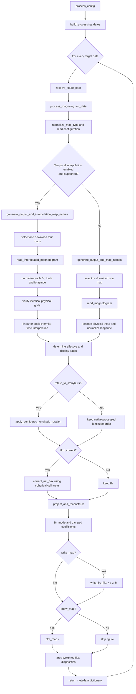

# Spherical-Harmonic Magnetogram Pipeline

This document describes the complete execution path of
`sph_filtering.process_config`. The launch module contains orchestration only;
the numerical, coordinate, input/output, and plotting operations live in the
specialized subpackages beside it.

## Entry point

```python
from coconut_tools.magnetogram.sph_filtering import process_config

results = process_config(config)
```

`process_config` always returns a list. A single-date configuration produces a
one-element list; a time-series configuration produces one result dictionary
per target time.

## Complete call cycle



### Function-by-function summary

| Order | Function | Responsibility | Main output |
|---:|---|---|---|
| 1 | `process_config` | Expand the run and iterate over target dates | List of result dictionaries |
| 2 | `build_processing_dates` | Parse the start date and construct the cadence | `list[datetime]` |
| 3 | `resolve_figure_path` | Select a unique figure path when needed | PNG path or `None` |
| 4 | `process_magnetogram_date` | Orchestrate one complete target | One result dictionary |
| 5a | `generate_output_and_map_names` | Select/download a single map and name the boundary | `.dat` path and source path |
| 5b | `generate_output_and_interpolation_map_names` | Select/download the four-map stencil | `.dat` path, four paths, selection |
| 6a | `read_magnetogram` | Read one product and construct its physical grid | `Br, Theta, Phi` |
| 6b | `read_interpolated_magnetogram` | Normalize four maps and interpolate in time | `Br, Theta, Phi, Br_linear` |
| 7 | `magnetogram_effective_date` | Determine the time represented by the field | Effective `datetime` |
| 8 | `apply_configured_longitude_rotation` | Optionally roll Carrington columns to Stonyhurst | Rotated fields and angle |
| 9 | `correct_net_flux` | Optionally balance flux with exact cell areas | Corrected `Br` |
| 10 | `project_and_reconstruct` | Project, damp modes, and reconstruct | `Br_mode, coefbr` |
| 11 | `write_bc_file` | Optionally serialize the COCONUT boundary | `x y z Br` file |
| 12 | `plot_maps` | Optionally save the physical-grid comparison | PNG figure |
| 13 | `_flux_summary` | Log integrated output-field diagnostics | Positive, negative, net flux, imbalance |

## Stage 1: target-date expansion

`process_config` calls `io.downloads.build_processing_dates`.

- With only `date`, the result is `[date]`.
- With positive `total_hours`, `cadence_hours` must also be positive.
- Dates are generated from the starting time while `current < start +
  total_hours`; the end time is therefore exclusive.
- The misspelled legacy key `candence` is accepted when `cadence_hours` is not
  present.

For several target dates, an explicitly supplied figure filename receives a
timestamp before its extension. Default figure names already contain the
effective timestamp.

## Stage 2: product selection and acquisition

`normalize_map_type` accepts names case-insensitively and converts them to a
canonical product name. Supported families are:

- `GONG`, `GONG_mrzqs`, `GONG_mrbqs`, `GONG_mrbqj`, `GONG_mrmqs`, and
  `GONG_mrnqs`;
- `ADAPT` and `HMI_fdt` ensemble products;
- `HMI_small`, `HMI_polfil`, `HMI_SYNC`, and `HMI_hourly`;
- `WSO`.

For a single map, `generate_output_and_map_names` computes the Carrington
rotation number, builds the method-specific `.dat` name, reuses an existing
local file when possible, or selects/downloads the appropriate remote product.
`HMI_SYNC` uses the dedicated JSOC path; `drms_email` (or the legacy alias
`jsoc_email`) is forwarded to that acquisition path.

Integral GONG products are published about once per Carrington rotation. Their
candidate search therefore covers the previous, current, and next calendar
month before selecting the closest filename time; a target near a month
boundary cannot be forced onto the following rotation merely because its
folder happens to share the target month.

Temporal interpolation is used only when both conditions are true:

1. `interpolation` evaluates to true;
2. the product is a synchronic GONG product, `ADAPT`, `HMI_hourly`, or
   `HMI_fdt`.

The default for `interpolation` is true for temporal GONG and `ADAPT`, and false
for other products. GONG diachronic products (`mrmqs` and `mrnqs`) cannot use
temporal interpolation.

The interpolated path selects four ordered observations:

```text
before_previous -> before -> target time -> after -> after_next
```

The two central maps bracket the target. The outer maps estimate time
derivatives for second-order interpolation.

### Custom local FITS input

Setting `custom_magnetogram` to a file path bypasses product discovery,
downloading, and temporal interpolation. `map_type` may be omitted because the
pipeline assigns the internal type `custom`:

```python
config = {
    "date": "2026-08-01T16:24:00",
    "custom_magnetogram": r"C:\Users\luisl\Desktop\AI_synopt_20260801_162400_TAI.fits",
    "interpolation": True,          # explicitly ignored for custom input
    "rotate_to_stonyhurst": True,
}
```

Calling `read_magnetogram(path)` directly also selects custom mode. At this
stage, a custom input must be one 2D FITS image with complete latitude WCS and
a separable, regular, full-360-degree longitude axis. The longitude decoder
uses `CTYPE1`, `CUNIT1`, `CRPIX1`, `CRVAL1`, and `CDELT1` or `CD1_1`; it
supports degrees or radians, reverses a negative axis, and rolls the smallest
wrapped longitude to the first column unless the headers identify a supported
original product.

One deliberate compatibility exception is made for an original GONG FITS.
When FITS provenance (`ORIGIN`, `OBS-SITE`, `TELESCOP`, or `INSTRUME`)
identifies GONG, custom mode infers the GONG family without inspecting the
filename. It then reuses the native GONG reader and longitude convention.
The configured date supplies both its displayed time and its Stonyhurst
rotation time. This is necessary because
historical GONG files omit `CUNIT1`/`CUNIT2` and carry product-specific origin
information. Renaming the file cannot change its interpretation. Therefore a
custom GONG path gives the same arrays and rotation as explicitly selecting
GONG. For a generic solar WCS with a missing
`CUNIT1`, degrees (or radians for a complete `2*pi` numeric span) are inferred
with a warning.

An original JSOC HMI synoptic FITS is identified from the joint provenance,
synoptic-content, and Carrington CEA axis metadata. Custom mode then reuses the
native HMI interpretation: `abs(CDELT1)` supplies the longitude spacing, the
stored `Br` columns are not reflected, and updated/daily maps retain their
Carrington-zero roll. A FITS that does not satisfy this complete signature
continues to follow the ordinary WCS sign. No filename is consulted.

The custom effective/display date is always `config["date"]`. The same value
is passed unchanged to the longitude rotation. FITS time keywords remain
available as metadata, but they are not selected implicitly: this prevents a
production time, last-contributor time, or differently defined record time
from silently overriding the epoch chosen by the user.

For custom rotation, `CTYPE1=CRLN-*` declares Carrington longitude and
`CTYPE1=HGLN-*` declares Stonyhurst longitude. For a Carrington map, the
Earth-viewed central meridian is computed at `config["date"]`.
An HGLN map is already Stonyhurst and is not rolled again. Ambiguous axis names
such as `LON-CAR` are rejected: the `-CAR` suffix means the plate-carree WCS
projection and does not identify a Carrington reference frame.

## Stage 3: physical grid reconstruction

The single-map path calls `io.readers.read_magnetogram`; the temporal path calls
`io.readers.read_interpolated_magnetogram`. Both return a radial field and the
same grid convention:

```text
Br.shape == Theta.shape == Phi.shape == (Ntheta, Nphi)
theta = Theta[:, 0]       # colatitude, radians, north to south
phi   = Phi[0, :]         # longitude, radians
0 <= theta <= pi
```

### FITS latitude decoding

`read_fits_theta_axis` obtains latitude cell centers from the first image HDU.
The decoding priority is:

1. explicit sine-latitude units or `CTYPE2=CSLT`;
2. `LATTYPE` declarations;
3. a standards-compliant angular CEA WCS, inverted with Astropy/WCSLIB;
4. a linear angular latitude axis using `CRPIX2`, `CRVAL2`, and `CDELT2` or
   `CD2_2`.

The axis must be finite, strictly monotonic, and inside `[-90 deg, 90 deg]`.
Rows of `Br` are reversed when required so that `theta` always increases from
north to south.

If required metadata are absent, the reader logs a warning and uses a known
cell-centered product grid:

- GONG and HMI: uniform in `mu = cos(theta) = sin(latitude)`;
- ADAPT and HMI-FDT: uniform in latitude/colatitude.

No artificial pole center is inserted. With `resize=True`, the image is
resampled to `360 x 720`, while the new theta centers preserve the original
outer cell edges in the native coordinate (`mu` or `theta`).

WSO follows its historical text-reader path. Its duplicate longitude endpoint
is retained and its sine-latitude variant is interpolated by that dedicated
reader.

### Longitude normalization

- Ordinary FITS products are reordered to increasing longitude when the FITS
  direction requires it.
- Dynamic HMI products are rolled so Carrington longitude zero is first.
- Temporal GONG maps additionally apply the filename-encoded circular shift.
- `NaN` and infinite field values are replaced through `numpy.nan_to_num`.

### Temporal interpolation

Every map in the four-map stencil is normalized before interpolation. The code
rejects inconsistent array shapes and physical theta axes rather than silently
remapping them. HMI-FDT additionally requires the same complete, fixed
Carrington longitude grid in all four files.

- `interpolation_order=1`: linear interpolation between `before` and `after`;
- `interpolation_order=2`: cubic Hermite interpolation using centered time
  derivative estimates from all four maps.

The temporal reader returns both `Br` (the selected interpolation result) and
`Br_linear`. `Br_linear` is retained for diagnostics/metadata and is rotated
with `Br`, but the spherical-harmonic projection uses `Br`.

## Stage 4: effective time and Stonyhurst rotation

`magnetogram_effective_date` defines the time physically represented by the
map:

- an interpolated map represents the requested target time;
- a custom map uses `config["date"]`;
- non-interpolated GONG, ADAPT, HMI-SYNC, HMI-hourly, and HMI-FDT maps use the
  observation time encoded in their filename;
- HMI small, HMI polar-filled, and WSO use the target time by convention.

If `rotate_to_stonyhurst=True`, `apply_configured_longitude_rotation` computes
the Carrington central meridian at the effective time, finds the closest actual
longitude column, and circularly rolls `Br`. The same roll is applied to
`Br_linear`. WSO is handled with its duplicate `0/360 deg` endpoint preserved.

For custom FITS input, the reference frame comes from `CTYPE1`, not from the
filename. A Carrington axis uses the ephemeris value at `config["date"]`;
native `HGLN-*` axes require no Carrington-to-Stonyhurst roll. The target
source column includes the first physical `phi` center, so a centered grid
such as `0.05, 0.15, ...` remains geometrically consistent after rotation.

The numeric `phi` array remains the standard output axis. The frame change is
encoded by reordering the field columns so that the field at the Stonyhurst
zero meridian occupies the zero-longitude column.

## Stage 5: optional net-flux correction

`processing.flux_balance.correct_net_flux` constructs exact spherical pixel
solid angles from cell edges:

```math
Delta Omega_ij = |cos(theta_{i-1/2}) - cos(theta_{i+1/2})| Delta phi_j.
```

Cell edges are inferred in `mu=cos(theta)` for sine-latitude grids and in
`theta` for latitude grids. Longitude widths are periodic and sum to `2 pi`.

Two methods are available:

- `surface_mean`: subtracts the area-weighted mean field from every pixel;
- `polarity_scaling`: multiplicatively rescales positive and negative
  polarities to equalize their integrated flux magnitudes.

The correction occurs before the harmonic projection. It is skipped entirely
unless `flux_correct=True`.

## Stage 6: spherical-harmonic filter

`processing.spherical_harmonics.project_and_reconstruct` validates that `Br`,
`Theta`, and `Phi` have identical two-dimensional shapes. It then projects on
complex spherical harmonics using the exact pixel areas:

```math
a_lm = sum_ij Br_ij Y_lm*(theta_i, phi_j) Delta Omega_ij.
```

The implemented modes are `l = 1 ... lmax` and `m = 0 ... l`; the monopole
`l=0` is deliberately absent. Each coefficient receives the regularization
factor

```math
D_l = 1 / (1 + alpha l^2 (l + 1)^2).
```

Reconstruction uses the real part of the non-negative-`m` representation and
doubles contributions for `m > 0`. Finally:

```text
Br_mode = reconstructed_field / 2.2 * amp
```

Increasing `lmax` retains smaller angular scales. Increasing `alpha` damps
high-degree structure more strongly. The returned `coefbr` array contains the
damped complex coefficients before the final `/2.2 * amp` reconstruction
scaling.

## Stage 7: boundary file and figure

With `write_map=True`, `io.writers.write_bc_file` writes:

```text
x  y  z  Br
```

where `(x, y, z)` is computed on the sphere of radius `r_st` from the physical
`theta` and `phi`. Every non-polar latitude ring keeps all longitudes. A row is
collapsed to one Cartesian point only when its center is genuinely `theta=0`
or `theta=pi` within an absolute tolerance of `1e-12`. The declared
`!PHOTOSPHERE` point count is computed from the number of actual polar rows.

With `show_map=True`, `visualization.plotting.plot_maps` saves a two-panel
input/processed comparison. Cell edges, rather than center extrema, define the
plot extent. Nonuniform axes use `pcolormesh`; a uniform sine-latitude axis may
use `imshow`. Color limits are symmetric and based on the 99th percentile of
the absolute field, with colorbar extensions indicating clipped extrema.

The panel labelled "Original magnetogram" is the map after longitude
normalization/rotation and after optional flux correction, immediately before
the harmonic filter.

## Configuration reference

| Key | Default | Role |
|---|---:|---|
| `date` | required | ISO timestamp or `datetime` for the first target |
| `map_type` | required unless custom | Magnetogram product identifier |
| `custom_magnetogram` | `None` | Local 2D FITS path; overrides `map_type`, downloads, and interpolation |
| `cadence_hours` | unset | Time-series cadence; `candence` is accepted as a legacy alias |
| `total_hours` | unset | Exclusive duration of the time series |
| `output_dir` | `../` | Boundary-file directory and default download directory |
| `download_dir` | `output_dir` | Directory for four-map interpolation inputs |
| `output_path_fig` | unset | Figure file or directory |
| `lmax` | `20` | Highest reconstructed spherical-harmonic degree |
| `alpha` | `0` | Harmonic regularization strength; must be non-negative |
| `amp` | `1` | Multiplicative field amplitude after `/2.2` |
| `r_st` | `1.0` | Radius used for boundary Cartesian coordinates |
| `adapt_map` | `6` | Zero-based ensemble realization selected from ADAPT/HMI-FDT |
| `interpolation` | product-dependent | Enable four-map temporal interpolation |
| `interpolation_order` | `2` | `1` for linear, `2` for cubic Hermite; `Interp_order` is a legacy alias |
| `resize` | `False` | Resample the field to `360 x 720` while preserving latitude bounds |
| `rotate_to_stonyhurst` | `True` | Roll field columns into the Stonyhurst frame |
| `flux_correct` | `False` | Apply an area-aware net-flux correction before SPH |
| `flux_correction_method` | `surface_mean` | `surface_mean` or `polarity_scaling` |
| `write_map` | `True` | Write the COCONUT boundary file |
| `show_map` | `True` | Save the diagnostic figure |
| `visu_type` | `sinlat` | `lat` for latitude or any other value for sine latitude |
| `drms_email` / `jsoc_email` | unset | JSOC identity used where required |

Boolean-like strings such as `"true"`, `"yes"`, `"1"`, and `"on"` are
accepted by the shared configuration parser.

## Returned metadata

Each list element contains:

| Key | Meaning |
|---|---|
| `date` | Requested target time as `datetime` |
| `effective_date` | Time physically represented by the processed map |
| `magnetogram_date` | Date used in the figure title |
| `output_name` | Intended `.dat` path |
| `local_file` | One source path or the four interpolation paths |
| `figure_path` | Saved figure path, or `None` |
| `selection` | Four-map interpolation metadata, or `None` |
| `Br_linear` | Linear temporal interpolation, or `None` |
| `coefbr` | Damped complex spherical-harmonic coefficients |
| `rotation_angle` | Applied rotation angle in degrees, or `None` |

## Operational notes

- The `.dat` filename is based on product and method, not target time. A
  multi-date run with one unchanged `output_dir` writes successive dates to the
  same path; the last write replaces the earlier boundary file.
- Figures are closed after saving, so large time series do not accumulate open
  Matplotlib figures.
- Invalid WCS metadata, incompatible interpolation grids, unsupported map
  types, invalid harmonic parameters, or inconsistent array shapes raise clear
  exceptions rather than triggering a silent spatial remapping.

## Module ownership

| Responsibility | Module |
|---|---|
| Pipeline orchestration | `magnetogram.sph_filtering` |
| Dates, product selection, downloads, names | `magnetogram.io.downloads` |
| FITS/text reading and temporal interpolation | `magnetogram.io.readers` |
| Latitude decoding and exact cell areas | `magnetogram.core.coordinates` |
| Carrington/Stonyhurst longitude handling | `magnetogram.processing.longitude` |
| Flux correction and diagnostics | `magnetogram.processing.flux_balance` |
| SPH projection and reconstruction | `magnetogram.processing.spherical_harmonics` |
| COCONUT `.dat` output | `magnetogram.io.writers` |
| Diagnostic figures | `magnetogram.visualization.plotting` |
